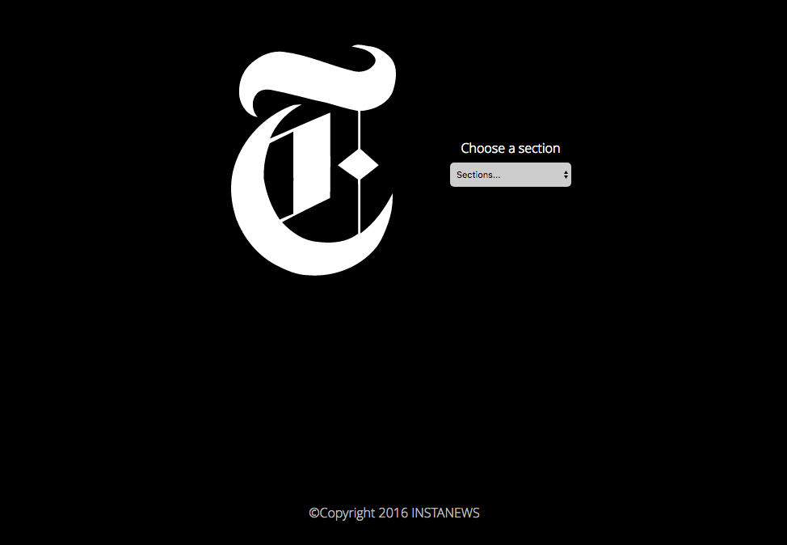

# InstaNews NYT Article Reader

This is my second website build as part of the Red Academy's Web Development program!

It is a simple website that displays articles from the New York Times using their API. 

When the user first enters the website, they are greeted with a minimalist splash page asking them to select a section of the NYT. This splash page is simply the page header taking up the entire screen. 

After the user selects a section, a series of JQuery actions are triggered that reduce the size of the header and load the NYT articles corresponding to that section. 

The header changes size thanks to a change in class. The css file contains two separate css styles for the .splash and .header classes. When the user selects an option in the dropown menu, the class of the header changes to make the layout changes possible. 

After the header is changed to make space for the articles, a loading gif appears while an Ajax function retrieves the article information from the NYT API. More information about the NYT API can be found here: https://developer.nytimes.com/ 

The article information is then appended into the content section using a JQuery .each() loop and appears with the use of a fade-in animation on the css file. 

This animation took me some time to work out. Originally, I was trying to place the animation on the parent container, but this meant that the animation would only run once. When the user refreshed the articles again by selecting a new NYT section, the animation would not run. Thanks to the help of one of the Red Academy instructors, Jim B., I moved the animation styles to the class controlling the articles so the animation would run every time the articles were refreshed. 

I attempted to stylize the dropdown menu using the Selectic JQuery plugin, but I was not able to make the plugin work properly. In the future, I would like to come back to this project and figure out what I was doing wrong the first time around. 

